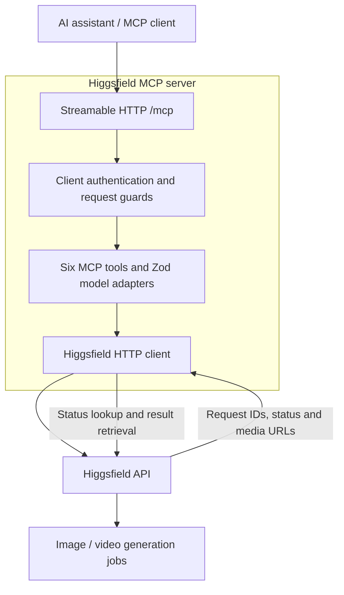

# Higgsfield MCP

A TypeScript MCP server connecting AI assistants to Higgsfield image and video generation.

## Overview

Higgsfield MCP gives ChatGPT and compatible MCP clients a validated interface for discovering supported models, estimating costs, submitting generation jobs, and retrieving their status and results. It uses the official MCP TypeScript SDK, Zod schemas, and Streamable HTTP at `/mcp`.

The source is public. Each installation runs with its own configuration and Higgsfield API account; cloning this repository does not grant access to the author's accounts.

## Key capabilities

- **Six MCP tools** covering model discovery, cost estimation, image/video generation, status, and results.
- **Model-specific validation** through explicit adapters rather than arbitrary model paths or unvalidated parameters.
- **Asynchronous generation** with request IDs, restart-safe status lookup, and bounded optional result polling.
- **Server-side credentials** with separate OAuth authentication for remote MCP clients.
- **Local and container workflows** with health checks, diagnostic scripts, structured redacted logs, and mocked tests.

## MCP tools

| Tool | Behavior |
|---|---|
| `hf_list_models` | Supported model IDs, documentation links and parameter schemas; optional `kind` filter |
| `hf_estimate_cost` | Live `credits` and `usd` quote when available, or Higgsfield's token-pricing description; accepts `model` and `input` |
| `hf_generate_video` | Submit video generation and return `request_id` immediately |
| `hf_generate_image` | Submit image generation and return `request_id` immediately |
| `hf_get_generation_status` | Check an existing `request_id` once |
| `hf_get_generation_result` | Return completed media URLs or pending status; optional `wait_seconds` from 0 to 25 |

This release includes two verified adapters:

| Kind | Model ID |
|---|---|
| Video | `bytedance/seedance-2.0/text-to-video` |
| Image | `higgsfield-ai/soul/v2/standard` |

`hf_list_models` is explicitly a **supported catalog shipped with this project**, not the full live Higgsfield catalog. This tool reads the project's adapter catalog rather than discovering models from a live provider endpoint. Adding a model requires a verified model-specific Zod adapter in `src/higgsfield/models.ts`; arbitrary model paths and parameters are rejected. Prices are never hard-coded.

Example `hf_estimate_cost` arguments:

```json
{
  "model": "higgsfield-ai/soul/v2/standard",
  "input": { "prompt": "An editorial portrait in soft daylight", "batch_size": 1 }
}
```

Example `hf_generate_video` arguments:

```json
{
  "model": "bytedance/seedance-2.0/text-to-video",
  "input": {
    "prompt": "A cinematic tracking shot along a sunlit coastal road",
    "duration": 5,
    "resolution": "720p",
    "aspect_ratio": "16:9",
    "generate_audio": true
  }
}
```

Generation tools return a structured envelope such as this illustrative example:

```json
{
  "ok": true,
  "data": {
    "request_id": "d7e6c0f3-6699-4f6c-bb45-2ad7fd9158ff",
    "status": "queued",
    "status_url": "https://api.higgsfield.ai/requests/d7e6c0f3-6699-4f6c-bb45-2ad7fd9158ff/status"
  }
}
```

Pass that `request_id` and, when available, `status_url` to the status/result tool. Status URLs are validated against the official origin and the exact request path. ID-only calls use the documented status route, so jobs remain accessible after server restarts. The client stores no in-memory ownership/session database. All allowed OAuth subjects are trusted members of **one shared Higgsfield account** and can access that account's jobs. Deploy separate instances/keys for independent users; this is not a multi-tenant service.

The result tool checks once by default (`wait_seconds: 0`), returning `ready: false` if work is pending. Optional polling starts at two seconds, backs off with jitter, and ends within 25 seconds. A timeout leaves the upstream generation running. Save the ID and check later. Completed results use `images[].url` or `video.url` from the same status endpoint; there is no invented `/result` route. Preserve media in your own storage if needed beyond Higgsfield's retention period.


## Architecture



Client authentication is OAuth in remote production mode; local development mode is anonymous and bound to loopback. Higgsfield API authentication is handled separately by the server-side HTTP client. Media generation happens upstream; this server returns URLs and does not download or proxy generated files.

- `src/higgsfield/`: reusable HTTP client, model schemas, payload types and error mapping; no MCP dependencies.
- `src/mcp/tools.ts`: six validated tools, structured responses and safety annotations.
- `src/app.ts`, `src/auth.ts`, `src/config.ts`: HTTP transport, OAuth JWT verification, fail-closed configuration and health check.
- `src/logger.ts`: structured logging with secret-value and sensitive-field redaction. Prompts, authorization headers, full errors and raw provider responses are not logged.
- `scripts/`: non-generating connection and MCP discovery checks; `tests/`: unit and protocol/integration tests.

HTTP requests have a 15-second total budget including read retries. Only GET status requests retry transient errors, at most twice; `Retry-After` is honored, and waits over five seconds are returned to the caller. Generation and estimate POSTs never auto-retry. The current client does not send provider idempotency keys: after a network failure or timeout, check the console before resubmitting. The provider now documents idempotency, but using it would require a separate implementation change. Error codes distinguish credentials, balance, unsupported models, input/prompt, failure/moderation/cancellation, timeout, not-found, rate limits, and unexpected responses. Provider `400/422` cannot reliably distinguish prompt rejection from other validation and map to `INVALID_INPUT`; local prompt validation is explicit.


## Quick start

Install **Node.js 24 or later**, npm, and Git.

```sh
git clone https://github.com/Saif9398/higgsfield-mcp.git
cd higgsfield-mcp
npm ci
```

Create your own local configuration without overwriting an existing `.env`:

```sh
# macOS / Linux
cp .env.example .env
```

```powershell
# Windows PowerShell
Copy-Item .env.example .env
notepad .env
```

The tracked `.env.example` contains blank values only. Open `.env` locally and supply your own complete credential from the [Higgsfield API console](https://open.higgsfield.ai):

```dotenv
HF_CREDENTIALS="YOUR_KEY_ID:YOUR_KEY_SECRET"
PORT=3000
```

The value above is a placeholder. Use your full `KEY_ID:KEY_SECRET` value without a `Key ` or `Bearer ` prefix. If a copied credential already includes the colon, use it intact; do not split it or append another secret. A standalone opaque value is not a supported replacement in this implementation: consult the provider's API example rather than guessing another component. Never share the actual value in chat.

Start development mode:

```sh
npm run dev
```

Or build and run compiled JavaScript:

```sh
npm run build
npm start
```

Default endpoints:

| Endpoint | Purpose |
|---|---|
| `http://127.0.0.1:3000/health` | Process health and credential-presence check |
| `http://127.0.0.1:3000/mcp` | MCP Streamable HTTP endpoint |

Local mode supports health checks and model/tool discovery without credentials. Provider API operations require your credentials. A healthy process does **not** establish that those credentials are valid or that the account can access every model.

In a second terminal:

```sh
npm run check:mcp
```

This discovers the six tools and calls `hf_list_models`; it does not generate media. The separate, opt-in `npm run check:connection` makes an authenticated image **cost estimate**, not a generation. It checks the configured image adapter, not access to every Higgsfield model.

See [Windows setup](SETUP_WINDOWS.md) for PowerShell details and troubleshooting.

## Configuration

Blank template values select the defaults below. Production OAuth settings must be supplied explicitly.

| Variable | Purpose / default |
|---|---|
| `HF_CREDENTIALS` | Your combined Higgsfield API credential; blank in the template |
| `PORT` | HTTP port; `3000` |
| `HOST` | Bind address; `127.0.0.1` for local development |
| `AUTH_MODE` | `local` for loopback development, `oauth` for remote production |
| `NODE_ENV` | Runtime environment; `development` by default |
| `LOG_LEVEL` | Structured logging level; `info` |
| `PUBLIC_URL` | Public HTTPS origin only, without `/mcp`; required for OAuth |
| `OAUTH_ISSUER` / `OAUTH_JWKS_URL` | Your identity provider's issuer and signing-key endpoint |
| `OAUTH_ALLOWED_SUBJECTS` | Explicit allowlist of trusted account subjects; required for OAuth |
| `OAUTH_SCOPE` | Required access-token scope; `higgsfield:use` |
| `ALLOWED_ORIGINS` | Exact browser origins, comma-separated; empty by default |

See [DEPLOYMENT.md](DEPLOYMENT.md) for placeholder production configuration, token requirements, HTTPS, reverse proxies, and deployment verification. The application refuses anonymous local mode with a non-loopback host or production environment.

## Connecting to ChatGPT / MCP clients

1. Configure your own HTTPS deployment and OAuth identity provider using [DEPLOYMENT.md](DEPLOYMENT.md).
2. Follow the [current official ChatGPT connection guide](https://developers.openai.com/plugins/deploy/connect-chatgpt) to add the full HTTPS MCP URL, such as `https://mcp.example.com/mcp`. Interface labels and availability depend on your account and workspace policy.
3. Complete the OAuth linking flow and review the six discovered tools.
4. Begin with model discovery and cost estimation. Request generation only when you intend to spend the connected Higgsfield account's API balance.
5. After changing tools or metadata, restart/deploy the server and refresh the client connection.

Other MCP clients must support Streamable HTTP and the authentication mode of your deployment. ChatGPT cannot reach another machine's `localhost` directly. OpenAI's [Secure MCP Tunnel](https://developers.openai.com/api/docs/guides/secure-mcp-tunnels) has its own workspace setup; the temporary ngrok option below is specifically for development.

This project implements an OAuth **resource server**, not an authorization server. OAuth authenticates the MCP client separately from the Higgsfield API credential. No OpenAI API key is required by this server, and a Higgsfield key is not a substitute for MCP OAuth.

## Security & credential model

- **Real `HF_CREDENTIALS` are not included in the repository.** Every user supplies their own credential in their local environment or deployment secret manager.
- `.env` and other local environment files are excluded from Git; `.env.example` is the intentionally tracked blank template. Docker also excludes environment files.
- Credentials stay server-side. **Never paste them into ChatGPT, tool arguments, URLs, Git, or shared configuration files.**
- Higgsfield API credentials, OAuth settings/tokens, ngrok credentials, and deployment secrets are separate configuration responsibilities.
- Logs redact configured secret values and sensitive fields. Prompts, raw authorization headers, and raw provider responses are not logged.
- Tests use mocked provider responses and **do not spend credits**. Live generation can spend the connected account's own Higgsfield API balance; API billing is separate from website subscriptions.
- OAuth mode validates signed access tokens, issuer, audience, expiry, scope, and allowed subjects. MCP tool discovery is authenticated in that mode; health and OAuth resource metadata remain public.

One deployment uses one shared server-owned Higgsfield account. Restrict access to the owner or equally trusted teammates. See the account limitations below before exposing an instance.

## Deployment

A [Dockerfile](Dockerfile) is included. Its production defaults require OAuth and Higgsfield credentials, bind inside the container on `0.0.0.0`, and run as a non-root user. Inject secrets at runtime; they are not baked into the image.

The [deployment guide](DEPLOYMENT.md) covers OAuth setup, a loopback-published container behind HTTPS, reverse-proxy headers, rate limiting, and verification. HTTPS hosting, identity-provider registration, account access, and live generation must be verified in your own environment. Automated tests cannot establish those external conditions.

## Testing & development

```sh
npm run typecheck
npm run lint
npm test
npm run build
```

Tests mock Higgsfield HTTP responses and cover credential parsing, payloads, submission, status/results, validation, errors, retry/timeouts, redaction, MCP discovery/calls, HTTP transport, OAuth/JWT checks, and request guards. CI runs on Windows and Linux.

| Script | Purpose |
|---|---|
| `npm run dev` | TypeScript development server |
| `npm run build` / `npm start` | Compile and run the server |
| `npm run check:mcp` | Non-generating MCP discovery and supported-model check |
| `npm run check:connection` | Opt-in live image cost estimate using your credentials |

For remote diagnostic discovery, supply `MCP_URL` and, for OAuth, `MCP_ACCESS_TOKEN` through a private environment. Never put access tokens in URLs or committed files.

[VERIFICATION.md](VERIFICATION.md) records historical implementation checks; its dated results and repository-preparation notes are not a claim about today's visibility or a fresh test run.

## Temporary ngrok development tunnel

> **Spending risk:** exposing anonymous local mode through a public tunnel means anyone who obtains that URL may be able to invoke tools and spend the connected Higgsfield account's balance. HTTPS does not provide caller authentication. Use only for an explicitly intended temporary development session, and close the tunnel afterward. Permanent/public deployments require OAuth.

For an explicitly requested temporary development tunnel:

1. Install the [official ngrok agent](https://ngrok.com/download/windows) on the new PC. The binary and existing local ngrok configuration are intentionally excluded from this repository. On Windows the documented installer is `winget install ngrok -s msstore`; reopen the terminal afterward.
2. Sign into that person's own [ngrok dashboard](https://dashboard.ngrok.com) to obtain their authtoken. In PowerShell, run the included hidden-input setup script:
   ```powershell
   powershell -NoProfile -ExecutionPolicy Bypass -File .\scripts\configure-ngrok.ps1
   ```
   Paste the token only at its local hidden prompt. The script runs ngrok's authtoken configuration command, suppresses its raw output, and saves the token in ngrok's local user configuration. If ngrok is not on PATH, pass `-NgrokPath 'C:\path\to\ngrok.exe'`. On another OS, use ngrok's documented local configuration flow; never send the token to a chat or commit its configuration.
3. Keep the MCP server running on port 3000. In another terminal, start the temporary tunnel:
   ```sh
   ngrok http http://127.0.0.1:3000 --traffic-policy-file scripts/ngrok-traffic-policy.json --inspect=false --log=false
   ```
   The tracked traffic policy contains no credentials. It rewrites the upstream Host header for the local server. Request inspection is disabled.
4. Use the HTTPS origin displayed by **this new ngrok session**; do not reuse a URL from another person's PC. The assigned hostname depends on the ngrok account and may be reused across sessions. Append `/mcp` to that origin for the ChatGPT connection.
5. Verify the public URL in PowerShell, replacing the example origin with the one ngrok actually displayed:
   ```powershell
   $publicOrigin = 'https://YOUR-NGROK-HOST'
   Invoke-RestMethod ($publicOrigin + '/health') -UserAgent 'higgsfield-mcp-health-check'
   $env:MCP_URL = $publicOrigin + '/mcp'
   npm run check:mcp
   Remove-Item Env:MCP_URL
   ```
6. Add that exact HTTPS `/mcp` URL to ChatGPT. Leave both server and tunnel terminals open. Press Ctrl+C in the ngrok terminal when finished; this does not stop the local MCP server.

HTTPS encrypts the tunnel but local auth mode does not authenticate remote callers. Anyone with this temporary URL can invoke the tools and spend the connected account's balance. Share it only for the intended development session and close it afterward. Permanent/public deployments require the OAuth setup in [DEPLOYMENT.md](DEPLOYMENT.md).


## Public repository / cloning notes

This is a **public source repository** and can be cloned by anyone with Git. Cloning does **not** grant access to the author's Higgsfield, ngrok, OAuth, or deployment accounts.

Each installation uses its own local configuration and credentials. Higgsfield API credentials, OAuth settings, ngrok credentials, and deployment secrets are not included in this repository and must be supplied by each user through their own environment.

On another computer, clone the source, run `npm ci`, create `.env` from the blank example, and run the checks above. Never copy another person's `.env`, ngrok configuration, logs, caches, dependencies, or build output. Local runtime secrets and configuration are excluded from Git.

## Limitations / account model

- The included two-model adapter catalog is a project-supported subset, not every Higgsfield model. Account entitlement must be checked separately.
- Allowed OAuth subjects share one Higgsfield account, its spending balance, and its jobs. There is no per-tenant credential store or job-ownership database; deploy independent instances/keys for independent users.
- Generation runs asynchronously upstream. Polling timeouts and client disconnects do not cancel an already submitted generation.
- Media URLs follow provider retention. Save outputs to your own storage when longer retention is needed.
- Network failures after submission can be ambiguous. Check the account console before repeating a request to avoid duplicate charges.
- No project license has been selected. Public visibility does not itself grant a license to reuse or redistribute the code.

## Documentation references

The implementation's original provider references were reviewed in September 2026. Consult the current official documentation when configuring your own account or deployment.

- [Higgsfield documentation index](https://docs.higgsfield.ai/docs/llms.txt), [authentication](https://docs.higgsfield.ai/docs/authentication), [request lifecycle](https://docs.higgsfield.ai/docs/concepts/requests), [status schema](https://docs.higgsfield.ai/docs/api-reference/requests/get-request-status).
- [Polling](https://docs.higgsfield.ai/docs/concepts/polling), [errors/retries](https://docs.higgsfield.ai/docs/concepts/errors), [estimates and retention](https://docs.higgsfield.ai/docs/concepts/billing-and-retention).
- [Seedance 2.0 schema](https://open.higgsfield.ai/models/bytedance/seedance-2.0/text-to-video/api-reference), [Soul 2 schema](https://open.higgsfield.ai/models/higgsfield-ai/soul/v2/standard/api-reference).
- [Official TypeScript SDK](https://github.com/modelcontextprotocol/typescript-sdk), [OpenAI MCP requirements](https://developers.openai.com/plugins/build/mcp-server), [OpenAI OAuth requirements](https://developers.openai.com/plugins/build/auth).
- [ChatGPT connection guide](https://developers.openai.com/plugins/deploy/connect-chatgpt), [Secure MCP Tunnel](https://developers.openai.com/api/docs/guides/secure-mcp-tunnels), and [ngrok for Windows](https://ngrok.com/download/windows).
- Project guides: [Windows setup](SETUP_WINDOWS.md), [Deployment](DEPLOYMENT.md), [Historical verification record](VERIFICATION.md).

Documentation-confirmed model availability does not establish access by your account. This repository pins its MCP SDK dependencies in the lockfile; consult upstream release notes before upgrading.

## Author / Connect

Built by **Saif Builds AI** — building AI agents, SaaS products, and automation tools.

- **GitHub:** [Saif9398](https://github.com/Saif9398)
- **Instagram:** @saifbuildsai
- **TikTok:** @saifbuildsai
- **LinkedIn:** [Saif Ullah Kashif](https://www.linkedin.com/in/saifullahkashif93)

Instagram and TikTok are shown as handles; clickable profile URLs are intentionally omitted until independently verified.
